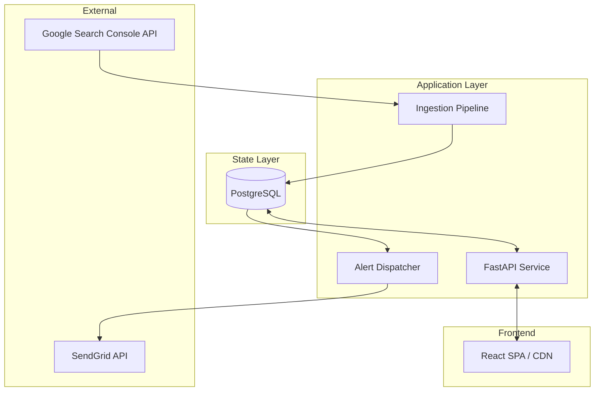

# GSC Radar 🛰️

**GSC Radar** is a data-driven SEO monitoring platform that detects search visibility anomalies in Google Search Console and dispatches executive alerts via SendGrid. It is built as a set of decoupled services sharing a common PostgreSQL state layer.

---

## 🏗️ System Architecture

GSC Radar is designed as a distributed set of stateless services connected by a shared PostgreSQL state layer.



### Core Components
- **API Service**: Stateless REST entry point for the frontend and OAuth handling.
- **Ingestion Pipeline**: Sequential process that syncs metrics from GSC to the database.
- **Alert Dispatcher**: Independent worker that processes pending alerts and handles transactional mail delivery.
- **Frontend SPA**: Static React dashboard deployed to a global CDN.

---

## ⚡ Technical Specification

### 1. Data Ingestion Model (The Pipeline)
The pipeline is designed to be executed as a recurring job (Cron). It performs a 3-step sequential sync per property:
1. **Property Metrics**: High-level sitewide aggregation.
2. **Page Metrics**: URL-level granularity (Filters for impressions > 0).
3. **Device Metrics**: Device-type breakdown.

### 2. Alert Dispatch Model (The Dispatcher)
To prevent the pipeline from blocking on slow external networks, the **Alert Dispatcher** runs as a separate worker process. It scans the `alerts` table for records marked `email_sent = false`, generates the multi-part HTML/Text payload, and dispatches via SendGrid.

### 3. State Management & Scoping
- **Persistence**: All metrics, accounts, and alerts are stored in PostgreSQL.
- **Multi-Tenancy**: The system is partitioned by `account_id` (UUID). Every database query is strictly scoped to this ID to ensure data isolation.
- **OAuth**: Handled backend-side. Tokens are stored at the `account` level.

---

## 🚀 Infrastructure Requirements

### Backend Environment Configuration
The backend requires a PostgreSQL instance and outbound access to Google and SendGrid APIs (Port 443).

```env
# Database Presence
DATABASE_URL=posgresql://<user>:<password>@<host>:<port>/<dbname>?sslmode=require

# Google Cloud OAuth 2.0 (GSC Scope)
GOOGLE_CLIENT_ID=<your-id>
GOOGLE_CLIENT_SECRET=<your-secret>
GOOGLE_REDIRECT_URI=https://api.yourdomain.com/api/v1/auth/google/callback

# SendGrid API
SENDGRID_API_KEY=SG.xxxxxxxxxxxxxxxxxxxxxx
SENDGRID_FROM_EMAIL=alerts@yourdomain.com

# CORS Configuration
FRONTEND_URL=https://dashboard.yourdomain.com
```

### Frontend Configuration
The frontend is a static React site. The backend endpoint must be injected at build time.
```env
VITE_API_URL=https://api.yourdomain.com/api/v1
```

---

## 🔍 Known Architectural Limitations

Recognizing the current trade-offs for developers:
- **Stateless Sessions**: Authentication is current session-based; no persistent RBAC or login state beyond the `account_id` query param logic and local storage.
- **Parallelism**: Pipeline uses a `ThreadPoolExecutor` within the main process rather than a standalone task queue (like Celery/Redis).
- **Caching**: No Redis/Memcached layer; all queries hit the DB directly.
- **Real-time**: Notification speed is bound by the Dispatcher's Cron interval (default 5m).

---

## 🛠️ Deployment Summary
1. **Database**: Provision PostgreSQL.
2. **Backend**: Deploy as a stateless service (L4/L7 LB recommended).
3. **Frontend**: Deploy `dist/` to a CDN (Vercel, Cloudflare Pages).
4. **Operations**: Set up two cron jobs—one for `pipeline` (daily) and one for `dispatcher` (every 5-15m).
