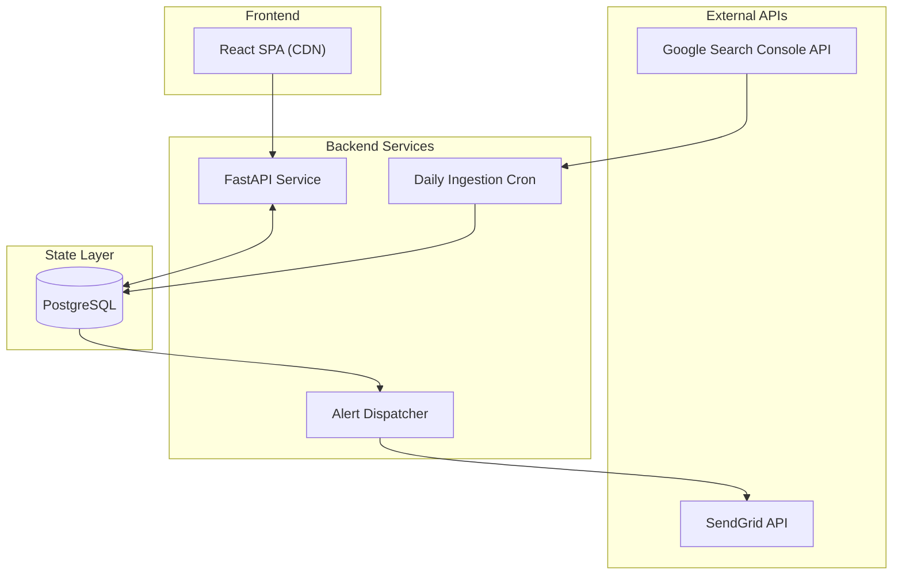

# GSC Radar 🛰️

GSC Radar is a production-grade SEO monitoring platform that detects significant search visibility anomalies in Google Search Console and dispatches executive-ready alerts via SendGrid.

The system is built as a set of decoupled, stateless services sharing a common PostgreSQL state layer, designed for reliability, isolation, and autonomous daily operation.

---

## 🏗️ High-Level Architecture

GSC Radar follows a distributed service architecture with strict separation of concerns.

---

## 🧩 Core System Components

### 1. [Backend API Service (FastAPI)](./backend/README.md)
- Stateless REST service handling OAuth 2.0 flow and serving dashboard data.
- Enforces strict `account_id` scoping and CORS controls.
- **Deep Dive**: See [backend/README.md](./backend/README.md) for full endpoint and auth specs.

### 2. Daily Ingestion Cron (7 AM Service)
- Standalone orchestration script iterating through all accounts.
- Runs the ingestion pipeline sequentially with DB-level locking (`pipeline_runs`).
- Updates time-series metrics and triggers anomaly detection.

### 3. Alert Dispatcher (5-Minute Worker)
- Decoupled worker polling the `alerts` table for unsent entries.
- Generates SaaS-style multi-part emails and sends them via SendGrid API.
- Marks as sent only after a `202 Accepted` response.

### 4. [Frontend React SPA](./frontend/README.md)
- Built with React + TypeScript, hosted on a CDN (e.g., Vercel).
- Communicates strictly with the FastAPI service; handles no OAuth tokens directly.
- **Deep Dive**: See [frontend/README.md](./frontend/README.md) for state, session, and UI specs.

---

## ⚙️ Technical Model

### Data Ingestion & Idempotency
1. **Phased Sync**: Property-level metrics -> Page-level metrics (Top 1000) -> Device-level metrics.
2. **Modes**: **Daily Mode** (1-day slide) vs **Backfill Mode** (16-day repair).
3. **Guarantee**: All writes use `ON CONFLICT (...) DO UPDATE` ensuring safe retries and data consistency.

### Anomaly Detection
- **7v7 Window**: Compares the most recent stable 7 days against the previous 7 days.
- **Trigger**: `delta_pct <= -10%` with a noise filter of `>= 100 impressions` in the previous window.
- **Isolation**: Every table is strictly scoped by `account_id` (UUID) to ensure multi-tenant safety.

---

## 🌐 Infrastructure & Environment

| Layer | Platform |
| :--- | :--- |
| **Frontend** | Vercel (Static CDN) |
| **Backend API** | Railway (Primary Service) |
| **Daily Cron** | Railway (Scheduled Job) |
| **Dispatcher** | Railway (Background Worker) |
| **Database** | Supabase (PostgreSQL 17) |
| **Email** | SendGrid API |

### Configuration Requirement
The system requires a synchronized environment between `backend/src/.env` and `frontend/.env`. See the respective READMEs for the complete list of required keys (GOOGLE_CLIENT_ID, SENDGRID_API_KEY, etc.).

---

## 🚀 Deployment Summary
1. Provision **PostgreSQL** (Supabase).
2. Deploy the **Backend API** service to hosting.
3. Deploy the **Alert Dispatcher** (5-min cron) and **Daily Ingestor** (7 AM cron).
4. Deploy the **Frontend** to a static CDN (Vercel).
5. Configure `ALLOWED_ORIGINS_STR` on the backend to match the frontend URL.

---

## �️ Design Principles
- **Statelessness**: Services can be horizontally scaled or restarted at any time.
- **Isolation**: Browser never sees OAuth tokens; tokens are stored and refreshed strictly server-side.
- **Autonomy**: Designed for cron-driven operation without manual intervention.
- **Simplicity**: No complex task brokers (Celery/Kafka) or Redis requirements.

---

## � Repository Structure
- **[/backend](./backend)**: FastAPI application, ingestion ingestors, and database schema.
- **[/frontend](./frontend)**: React dashboard and authentication hydration logic.
- **[/backend/database/current_schema.sql](./backend/database/current_schema.sql)**: Canonical DB snapshot.

---

## 🏁 Summary
GSC Radar is a multi-tenant, cron-driven, idempotent monitoring platform. It is optimized for operational clarity, strict data isolation, and autonomous daily performance monitoring.
