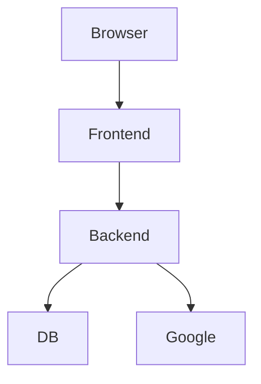

# GSC Radar – Frontend 🛰️

The GSC Radar Frontend is a stateless React SPA responsible for:
- User authentication initiation
- Session hydration
- Dashboard visualization
- Property-level analytics rendering
- Alert configuration management

**It does NOT:**
- Handle OAuth tokens
- Communicate directly with Google APIs
- Store sensitive credentials
- Perform ingestion or anomaly detection

> [!IMPORTANT]
> All privileged operations occur in the backend.

---

## 🏗️ System Role in Architecture

The frontend is a presentation layer only.



### 🔐 Trust Boundary
The browser only ever knows:
- `account_id` (UUID)
- `email`

**It never receives:**
- `access_token`
- `refresh_token`
- Google credentials
- SendGrid credentials

---

## 🧩 Core Responsibilities

| Responsibility | Description |
| :--- | :--- |
| **OAuth Initiation** | Redirect user to backend `/auth/google/url` |
| **Session Hydration** | Extract `account_id` and `email` from redirect |
| **Dashboard Rendering** | Fetch and display metrics from API |
| **Property Navigation** | Route between properties |
| **Alert Management** | Manage alert recipients |

---

## 🔐 Authentication Flow (Frontend Perspective)

The frontend participates in a controlled handshake.

### 1. Login Click
User clicks “Login with Google”. Frontend calls `GET /api/auth/google/url`. Backend returns Google auth URL. Frontend redirects user to that URL.

### 2. OAuth Callback Redirect
After Google authentication, backend redirects to:
`https://frontend-domain.com/?account_id=...&email=...`

### 3. Session Hydration (`AuthProvider.tsx`)
On mount:
1. Parse query parameters.
2. Store `account_id` and `email` in `localStorage`.
3. Immediately wipe URL:
```javascript
window.history.replaceState({}, document.title, window.location.pathname);
```
*This prevents leaking credentials (IDs) in browser history.*

### 4. Stateless Operation
All API calls include `account_id`. The backend validates and scopes queries using that UUID.
- No cookies.
- No JWT.
- No refresh tokens.
- **Intentionally stateless model.**

---

## 📊 Routing Model

The frontend uses client-side routing. Example: `/property/:propertyId`

When navigating to `/property/06694ec4-bbb1-4ab2-bea2-535e72697e55`:
1. Confirms `account_id` exists.
2. Calls `GET /properties/{id}/overview`.
3. If backend returns error, UI displays fallback state.

---

## 🧠 Data Model Expectations

### Dashboard Summary
`GET /dashboard-summary`
Returns website groups, property deltas, health classification, and 7v7 metrics. **Computed server-side.**

### Property Overview
`GET /properties/{id}/overview`
Returns last 7/prev 7 impressions, delta %, device breakdown, and top gaining/dropping pages.

### Alert Recipients
`GET /alert-recipients` / `POST /alert-recipients`

---

## 📦 Tech Stack
- **Framework**: React 18 (Vite)
- **Language**: TypeScript
- **Styling**: Tailwind CSS
- **Icons**: Lucide Icons
- **State**: Context API (Session state only)
- *No Redux, no global state library, no service workers.*

---

## 🧭 Session Architecture

- **State Storage**: `localStorage` (`account_id`, `email`)
- **No Expiration Enforcement**: Relies on server-side token validation.
- **No JWT/Frontend RBAC**: Security enforcement happens strictly server-side.

---

## 🛠️ Environment Configuration

**Required:** `VITE_API_URL=https://api.yourdomain.com/api/v1`
Injected at build time. Must match the deployed backend.

---

## 🚀 Deployment Model

### Production
- **Frontend**: Hosted on **Vercel** (Static Build, Global CDN Edge).
- **Backend**: **Railway** (3 services: API, Alert Dispatcher, Daily Ingestion Cron).
- **Database**: **Supabase** (Postgres).

### Vercel Build Configuration
- **Build command**: `npm install && npm run build`
- **Output directory**: `dist/`
- *No Node backend or SSR required.*

---

## 🔄 Runtime Behavior

The frontend is entirely dependent on backend availability.
- If backend is down: Login, Dashboard, and Property views fail.
- **No offline mode / No caching layer.**

---

## ⚠️ Known Architectural Limitations
1. Stateless session via `localStorage`.
2. No JWT verification.
3. No CSRF protection layer (relies on same-origin).
4. No rate limiting client-side.
5. No optimistic updates or background polling.

---

## 🛡️ Security Model

- **Frontend** does NOT enforce multi-tenancy isolation or permission checks.
- **Backend** enforces `account_id` scoping, data isolation, and OAuth validation.
- **Trust Layer**: The frontend is considered a non-trusted presentation layer.

---

## 📐 UX Architecture Notes
- No manual ingestion button in production (assumes cron-based sync).
- “Open in GSC Radar” deep-links rely on backend validation.
- Health statuses computed server-side.

---

## 🔎 CORS Considerations

Backend must include frontend domain in `ALLOWED_ORIGINS_STR`. If misconfigured:
- Preflight requests will fail.
- Login will break.
- API calls will be blocked.

---

## 🏁 Summary

The GSC Radar frontend is stateless, purely presentational, and dependent on backend validation. It is designed to safely initiate OAuth, hydrate sessions, and render analytics without ever exposing sensitive tokens.
